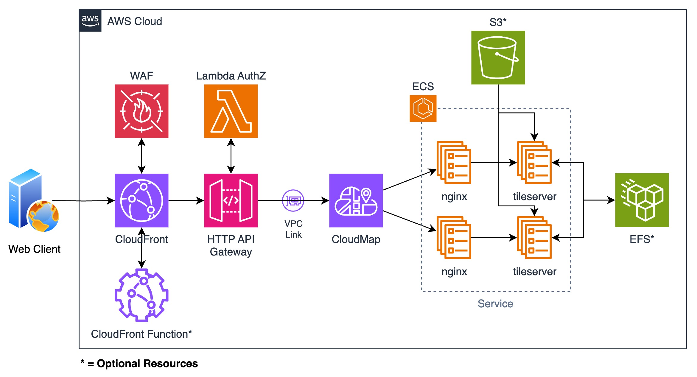

# Host TileServer on AWS

    

This terraform module manages the following services:
- CloudFront
- WAF
- CloudFront Function
- ACM
- HTTP API Gateway
- Lambda Authorizer
- VPC Private Link
- Cloud Map
- ECS
- S3
- EFS

## Architecture Diagram

## Useful Resources

### TileServer Container Images
- [maptiler/tileserver-gl-light](https://hub.docker.com/r/maptiler/tileserver-gl-light)
- [maptiler/tileserver-gl](https://hub.docker.com/r/maptiler/tileserver-gl)

This module uses `maptiler/tileserver-gl-light` by default which does not provide server-side rasterization of vector tiles, so if that's your requirement use `maptiler/tileserver-gl` image.

### TileServer Refs
- https://github.com/maptiler/tileserver-gl
- https://tileserver.readthedocs.io/en/latest/

### OpenMapTiles - For generating/downloading map vectors
- https://github.com/openmaptiles/openmaptiles
- https://openmaptiles.org/
- https://data.maptiler.com/downloads/planet/

### Third-party Refs
- https://osm.dbtc.link/ - For downloading vector tiles

:warning: **Important:** Always scan the files for security risk before using them :warning:
