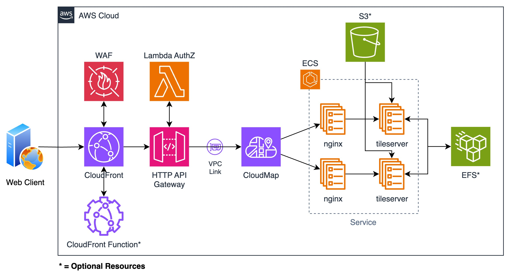

<!-- BEGIN_TF_DOCS -->
# Host TileServer on AWS

    

This terraform module manages the following services:
- CloudFront
- WAF
- CloudFront Function
- ACM
- HTTP API Gateway
- Lambda Authorizer
- VPC Private Link
- Cloud Map
- ECS
- S3
- EFS

## Architecture Diagram



## Useful Resources

### TileServer Container Images
- [maptiler/tileserver-gl-light](https://hub.docker.com/r/maptiler/tileserver-gl-light)
- [maptiler/tileserver-gl](https://hub.docker.com/r/maptiler/tileserver-gl)

This module uses `maptiler/tileserver-gl-light` by default which does not provide server-side rasterization of vector tiles, so if that's your requirement use `maptiler/tileserver-gl` image.

### TileServer Refs
- https://github.com/maptiler/tileserver-gl
- https://tileserver.readthedocs.io/en/latest/

### OpenMapTiles - For generating/downloading map vectors
- https://github.com/openmaptiles/openmaptiles
- https://openmaptiles.org/
- https://data.maptiler.com/downloads/planet/

### Third-party Refs
- https://osm.dbtc.link/ - For downloading vector tiles

:warning: **Important:** Always scan the files for security risk before using them :warning:

# Usage Instructions
## Example
```hcl
module "tileserver" {
  source = "github.com/paliwalvimal/tileserver-on-aws.git?ref=" # Always use `ref` to point module to a specific version or hash

  region                        = "eu-west-1"
  apigw_vpc_link_subnet_ids     = ["sub-xxxxxx", "sub-xxxxxx"]
  apigw_lambda_authz_subnet_ids = ["sub-xxxxxx", "sub-xxxxxx"]
  ecs_service_subnet_ids        = ["sub-xxxxxx", "sub-xxxxxx"]
  efs_subnet_ids                = ["sub-xxxxxx", "sub-xxxxxx"]
  tileserver_domain_name        = "tileserver.example.com"
  hosted_zone_id                = "Z000000000000000"
}
```

## Requirements

| Name | Version |
|------|---------|
| terraform | >= 1.12.0 |
| archive | >= 2.7.1 |
| aws | >= 6.0.0 |
| random | >= 3.7.2 |

## Inputs

| Name | Description | Type | Default | Required |
|------|-------------|------|---------|:--------:|
| apigw_create_lambda_authz | Whether to create lambda authorizer for API gateway | `bool` | `true` | no |
| apigw_lambda_authz_subnet_ids | List of subnet IDs to use for creating Lambda authorizer | `list(string)` | n/a | yes |
| apigw_lambda_authz_tracing_mode | Tracing mode to use for Lambda authorizer. Valid values: PassThrough, Active | `string` | `"Active"` | no |
| apigw_vpc_link_subnet_ids | List of subnet IDs to create ENIs for API Gateway to interact with ECS service | `list(string)` | n/a | yes |
| cloudfront_access_logs_destination_arn | ARN of destination to deliver the access logs to. Supported destinations are: S3, CloudWatch Logs, Kinesis Firehose. **Note:** Required only if `create_cloudfront_logs_bucket` is set to false | `string` | `""` | no |
| cloudfront_access_logs_format | Format of the logs that are sent to destination | `string` | `"json"` | no |
| cloudfront_cache_policy_id | ID of cache policy to associate with the default behaviour of cloudfront distribution. **Doc:** https://docs.aws.amazon.com/AmazonCloudFront/latest/DeveloperGuide/using-managed-cache-policies.html | `string` | `"4135ea2d-6df8-44a3-9df3-4b5a84be39ad"` | no |
| cloudfront_enable_access_logs | Enable v2 access logging for CloudFront distribution | `bool` | `true` | no |
| cloudfront_enable_waf | Whether to create a WAF with default configuration and attach it to the CloudFront distribution | `bool` | `true` | no |
| cloudfront_http_version | HTTP version to use for CloudFront distribution | `string` | `"http2and3"` | no |
| cloudfront_minimum_protocol_version | TLS protocol version to use for CloudFront distribution. For all supported versions, refer to [AWS doc](https://docs.aws.amazon.com/AmazonCloudFront/latest/DeveloperGuide/secure-connections-supported-viewer-protocols-ciphers.html) | `string` | `"TLSv1.2_2021"` | no |
| cloudfront_origin_request_policy_id | ID of response header policy to associate with the default behaviour of cloudfront distribution. **Doc:** https://docs.aws.amazon.com/AmazonCloudFront/latest/DeveloperGuide/using-managed-origin-request-policies.html | `string` | `"b689b0a8-53d0-40ab-baf2-68738e2966ac"` | no |
| cloudfront_price_class | Price class to use for CloudFront distribution | `string` | `"PriceClass_All"` | no |
| cloudfront_response_headers_policy_id | ID of response header policy to associate with the default behaviour of cloudfront distribution. **Doc:** https://docs.aws.amazon.com/AmazonCloudFront/latest/DeveloperGuide/using-managed-response-headers-policies.html | `string` | `null` | no |
| cloudfront_waf_id | ID of WAF to associate with the CloudFront distribution. **Note:** Required only if you want to associate a self-managed WAF. Make sure to set `cloudfront_enable_waf` to false to use a self-managed WAF | `string` | `null` | no |
| cors_origin_domain | Domain name to use for setting CORS `access-control-allow-origin` header | `string` | `"*"` | no |
| create_cloudfront_function | Whether to associate CloudFront Function to the distribution | `bool` | `true` | no |
| create_cloudfront_logs_bucket | Whether to create S3 bucket for storing CloudFront access logs | `bool` | `true` | no |
| create_s3_tileserver_data_bucket | Whether to create S3 bucket for storing tileserver data like config files, mbtiles, etc | `bool` | `false` | no |
| create_ssl_cert | Whether to create custom SSL certification for CloudFront distribution | `bool` | `true` | no |
| create_tileserver_dns_record | Whether to create DNS record for tileserver in Route53 | `bool` | `true` | no |
| cw_logs_kms_key_id | ID of KMS key to use for encrypting logs in CloudWatch | `string` | `null` | no |
| cw_logs_retention_days | Number of days to retain the API gateway logs for | `number` | `90` | no |
| ecs_enable_container_insights | Whether to enable container insights for ECS cluster | `bool` | `true` | no |
| ecs_enable_guard_duty_monitoring | Whether to enable guard duty monitoring for ECS cluster | `bool` | `true` | no |
| ecs_service_cpu | Hard limit of CPU units for the ECS service. This should be enough to run both nginx and TileServer containers. Valid values for CPU units: https://docs.aws.amazon.com/AmazonECS/latest/developerguide/task_definition_parameters.html#task_size | `number` | `1024` | no |
| ecs_service_max_replicas | Maximum number of replicas to run for ECS service | `number` | `2` | no |
| ecs_service_memory | Hard limit of memory for the ECS service. This should be enough to run both nginx and TileServer containers. Valid values for memory: https://docs.aws.amazon.com/AmazonECS/latest/developerguide/task_definition_parameters.html#task_size | `number` | `2048` | no |
| ecs_service_min_replicas | Minimum number of replicas to run for ECS service | `number` | `1` | no |
| ecs_service_nginx_container_cpu | Number of CPU units to provision for nginx container | `number` | `256` | no |
| ecs_service_nginx_container_image | Image to use for nginx container | `string` | `"mirror.gcr.io/nginxinc/nginx-unprivileged@sha256:5906f7b44fb9f54737bd57252fd2d7779b23dd5235243e7f9fd6c22e197853d4"` | no |
| ecs_service_nginx_container_memory | Amount (in MiB) of memory to provision for nginx container | `number` | `512` | no |
| ecs_service_nginx_init_container_image | Image to use for nginx init container | `string` | `"mirror.gcr.io/alpine@sha256:8a1f59ffb675680d47db6337b49d22281a139e9d709335b492be023728e11715"` | no |
| ecs_service_port | Port to expose for TileServer container | `number` | `8080` | no |
| ecs_service_subnet_ids | List of subnet IDs to create ENIs for TileServer ECS service | `list(string)` | n/a | yes |
| ecs_service_tileserver_container_cpu | Number of CPU units to provision for TileServer container | `number` | `256` | no |
| ecs_service_tileserver_container_image | Image to use for TileServer container | `string` | `"mirror.gcr.io/maptiler/tileserver-gl-light@sha256:a7ac7824ecb497c8971dd9c284416e96cd1c7e21e86a693fc82a37912670cd84"` | no |
| ecs_service_tileserver_container_memory | Amount (in MiB) of memory to provision for TileServer container | `number` | `512` | no |
| ecs_service_tileserver_init_container_image | Image to use for TileServer init container | `string` | `"mirror.gcr.io/amazon/aws-cli@sha256:48c3d4212e2f5b0e24bdc6af7708f9412ce65425a79575e0f78b8f8c0dcd70ab"` | no |
| efs_subnet_ids | List of subnet IDs to create mount points for EFS volume | `list(string)` | n/a | yes |
| env | Environment name: dev, qa, uat, staging, production | `string` | `"dev"` | no |
| hosted_zone_id | ID of hosted zone under which tileserver domain name needs to be registered. **Note:** Required only if either of `create_tileserver_dns_record` or `create_ssl_cert` is set to true | `string` | `""` | no |
| iam_role_max_session_duration | Maximum session duration for IAM role. If not provided, the default value of 3600 seconds (1 hour) is applied by AWS | `number` | `null` | no |
| region | Region where the resources will be deployed | `string` | n/a | yes |
| s3_kms_key | ARN/Alias/ID of KMS key to use for encrypting objects stored in S3 bucket | `string` | `"alias/aws/s3"` | no |
| tags | A map of key value pair to assign to resources | `map(string)` | `{}` | no |
| tileserver_acm_cert_arn | ARN of certificate stored in ACM to use for CloudFront distribution. **Note:** Only needed if `create_ssl_cert` is set to false | `string` | `""` | no |
| tileserver_data_bucket_apply_ssl_deny_policy | Apply the [default SSL deny policy](https://docs.aws.amazon.com/AmazonS3/latest/userguide/example-bucket-policies.html#example-bucket-policies-HTTP-HTTPS) to the S3 bucket. **Note:** Set this to false if you want to attach your own policy | `bool` | `true` | no |
| tileserver_domain_name | Domain name to associate with the CloudFront tileserver distribution | `string` | `""` | no |

## Outputs

| Name | Description |
|------|-------------|
| apigw_arn | ARN of the HTTP API Gateway |
| apigw_cwlg_arn | ARN of CloudWatch log group created to store API Gateway access logs |
| apigw_cwlg_name | Name of CloudWatch log group created to store API Gateway access logs |
| apigw_endpoint | Random URL assigned to the HTTP API Gateway by AWS |
| apigw_id | ID of the HTTP API Gateway |
| apigw_lambda_authz_arn | ARN of Lambda authorizer function created for API Gateway |
| apigw_lambda_authz_cwlg_arn | ARN of CloudWatch log group created to store Lambda authorizer logs |
| apigw_lambda_authz_cwlg_name | Name of CloudWatch log group created to store Lambda authorizer logs |
| apigw_lambda_authz_name | Name of Lambda authorizer function created for API Gateway |
| apigw_name | Name of the HTTP API Gateway |
| apigw_vpc_link_arn | ARN of VPC Private link created for HTTP API Gateway |
| apigw_vpc_link_id | ID of VPC Private link created for HTTP API Gateway |
| apigw_vpc_link_name | Name of VPC Private link created for HTTP API Gateway |
| cloud_map_svc_discovery_namespace_arn | ARN of the Cloud Map service discovery namespace |
| cloud_map_svc_discovery_namespace_id | ID of the Cloud Map service discovery namespace |
| cloud_map_svc_discovery_namespace_name | Name of the Cloud Map service discovery namespace |
| cloud_map_svc_discovery_svc_arn | ARN of the Cloud Map service discovery service |
| cloud_map_svc_discovery_svc_id | ID of the Cloud Map service discovery service |
| cloud_map_svc_discovery_svc_name | Name of the Cloud Map service discovery service |
| cloudfront_arn | ARN of CloudFront distribution |
| cloudfront_domain_name | Domain name assigned to CloudFront distribution |
| cloudfront_hosted_zone_id | Hosted zone ID of CloudFront distribution |
| cloudfront_id | ID of CloudFront distribution |
| cloudfront_ssl_cert_arn | ARN of SSL certificate attached to the CLoudFront distribution |
| ecs_cluster_arn | ARN of ECS cluster |
| ecs_cluster_name | Name of ECS cluster |
| ecs_service_arn | ARN of ECS service |
| ecs_service_name | Name of ECS service |
| ecs_service_security_group_id | ID of security group attached to ECS service |
| ecs_task_definition_arn | ARN of ECS task definition |
| ecs_task_definition_arn_without_revision | ARN of ECS task definition without revision |
| ecs_task_definition_family | Family name of ECS task definition |
| ecs_task_definition_revision | Revision of ECS task definition |
| ecs_task_execution_iam_role_arn | ARN of ECS task execution IAM role |
| ecs_task_execution_iam_role_name | Name of ECS task execution IAM role |
| ecs_task_iam_role_arn | ARN of ECS task IAM role |
| ecs_task_iam_role_name | Name of ECS task IAM role |
| efs_id | ID of EFS file system |
| efs_security_group_id | ID of security group attached to EFS file system |
| efs_tileserver_access_point_arn | ARN of EFS access point for tileserver container |
| efs_tileserver_access_point_id | ID of EFS access point for tileserver container |
| efs_tileserver_nginx_tmp_access_point_arn | ARN of EFS access point for nginx container |
| efs_tileserver_nginx_tmp_access_point_id | ID of EFS access point for nginx container |
| tileserver_cf_access_logs_bucket_arn | ARN of S3 bucket used to store CloudFront access logs |
| tileserver_cf_access_logs_bucket_name | Name of S3 bucket used to store CloudFront access logs |
| tileserver_cf_authz_token_ssm_param_arn | ARN of SSM parameter used for storing authZ token shared between CloudFront and API Gateway |
| tileserver_cf_authz_token_ssm_param_name | Name of SSM parameter used for storing authZ token shared between CloudFront and API Gateway |
| tileserver_data_bucket_arn | ARN of S3 bucket used to store TileServer config data |
| tileserver_data_bucket_name | Name of S3 bucket used to store TileServer config data |
| tileserver_domain_name | Domain name record created to access TileServer |
| waf_arn | ARN of WAF associated to CloudFront distribution |
| waf_id | ID of WAF associated to CloudFront distribution |
| waf_name | Name of WAF associated to CloudFront distribution |

<!-- END_TF_DOCS -->
